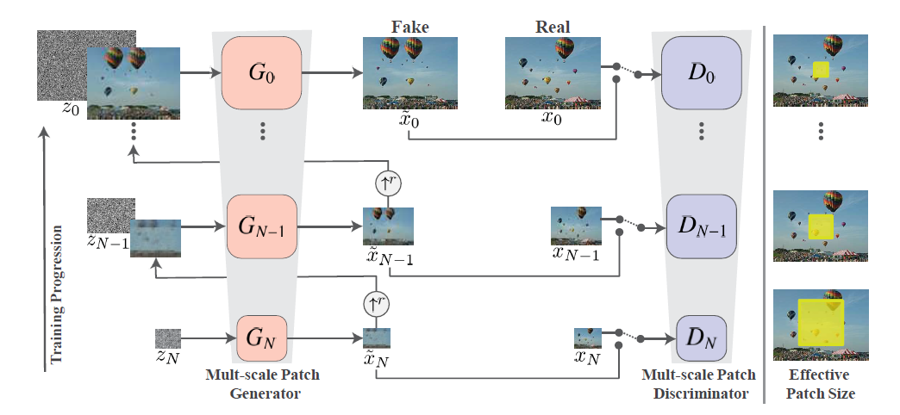
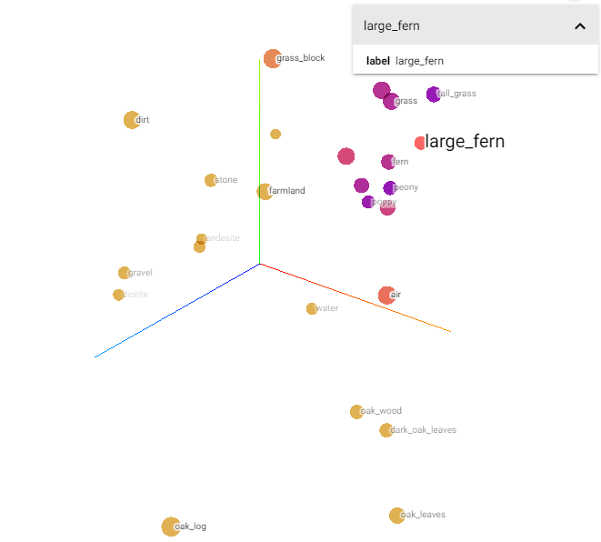
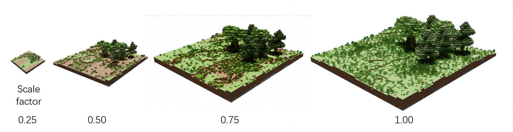
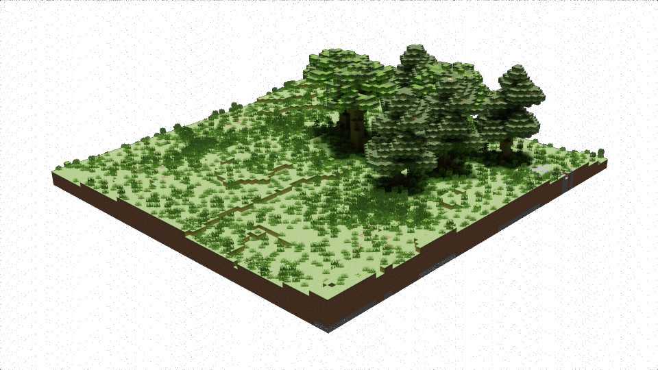
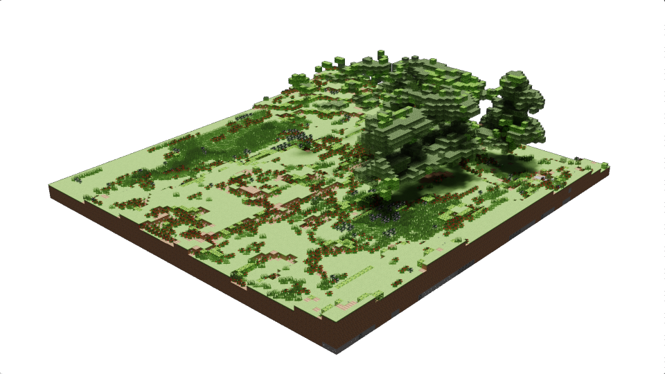
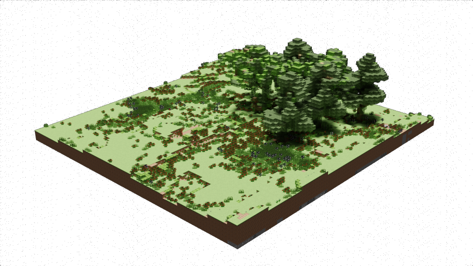
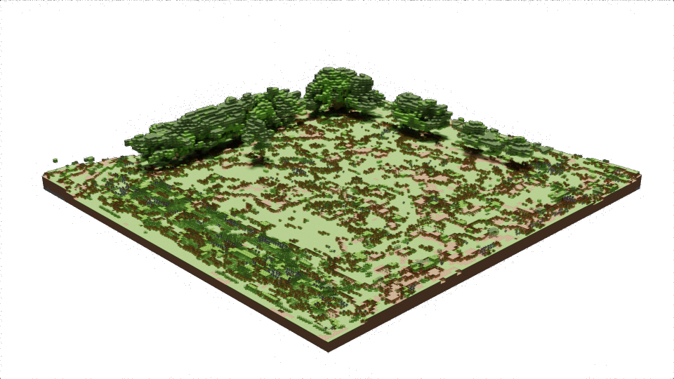

# TerrianGAN
3D terrian generated using SinGAN.

The method is roughly based on the paper [World-GAN: a Generative Model for Minecraft Worlds](https://arxiv.org/abs/2106.10155). 
The project consists of two parts
Block2Vec and SinGAN-3D.

## Implementation Details
- **block2vec** model comes from skip-gram and auto-encoder.
- The 3D space down/up sampling is based on grid sampling and trilinear interpoltation.
- re-implementation of **SinGAN** part with some fixes: 1. BatchNorm replaced by InstanceNorm, 2.reconstruct loss from MSE to Cosine Similarity.

## Block2Vec
3D terrian has a large number of available tokens: dirt, water, grass, tree, etc. A space with 100 x 100 x 20 blocks with 100 different tokens will cost 2e7 float bytes. 
**block2vec** uses skip-gram and auto-encoder model to transform geo space into a latent token-based space with few dims. 

fig. a list of tokens reprenseted in three-dimensional space

## SinGAN-3D
Down/Up sampling method using grid sample and trilinear interpoltation is happend in the latent space. 

fig. down sample in latent space then reprensted in geo space

## Random Generate
**Random Generate** 

raw terrian

random noise generated 1

random noise generated 2

**Random Size Generate** 
Can generate any size of terrian, due to full convolution network. 

2x size

